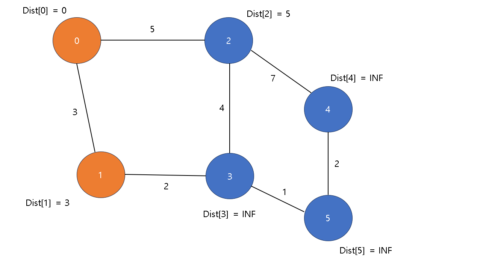

# 다익스트라(Dijkstra) 알고리즘

## 1. 다익스트라 알고리즘이란?
- BFS(깊이 우선 탐색), DFS(너비 우선 탐색)과 같은 그래프 탐색 알고리즘임

- 주로 시작 노드(출발지)부터 도착 노드(목적지)까지 이동하는 데에 있어 최소 비용을 구하는데 활용됨

- 그러므로 다익스트라 알고리즘은 각 노드(정점) 간의 비용이 함께 주어짐

## 2. 다익스트라 알고리즘의 원리
- Dist(거리 비용) 배열이란?<br>
→ 시작 노드부터 각 노드에 도착하는 데 들어가는 최소 비용(시작 노드의 Dist 배열 값은 0임)

- 다음과 같은 순서로 알고리즘이 작동함(그림 포함)
1. Dist 배열의 값을 전부 INF(= 무한대, 임의의 큰 값으로 설정)로 초기화<br>


예시 설명 : 노드가 0번(시작 노드) 부터 5번(도착 노드) 까지 존재하므로 Dist[0] ~ Dist[5]를 INF로 초기화

2. 시작 노드의 Dist 배열 값과 시작 노드와 연결된 노드의 Dist 배열 값을 구해 대입 후 시작 노드를 방문한 노드로 변경<br>


예시 설명 : Dist[0]은 시작 노드의 비용이므로 0으로 초기화 후 0번 노드와 연결된 노드인 1번과 2번 노드의 간선에서 비용 정보를 얻어 Dist 배열에 대입

3. 시작 노드에서 가장 비용이 적게 드는 노드를 선택하고, 해당 노드를 방문한 노드로 변경<br>



예시 설명 : 0번 노드와 연결된 가장 가까운 노드는 비용이 가장 적은 1번 노드이므로 1번으로 이동 후 방문한 노드임을 표시

4. 3번 과정에서 이동한 노드와 연결된 노드의 거리 비용 갱신<br>


예시 설명 : 1번 노드와 연결된 노드인 3번 노드의 비용은 (시작 -> 1번 비용인 3) + (1번 -> 3번 비용인 3) = 6 이므로 Dist[3]에 6를 대입

5. 다시 시작 노드를 기준으로 돌아가 도착 노드에 도달할 때까지 3번 ~ 4번을 반복


예시 설명 : 방문한 노드와 연결된 노드 중 가장 비용이 적은 2번 노드 선택 및 이동


예시 설명 : 이동한 노드인 2번 노드를 기준으로 거리 비용 갱신


예시 설명 : 방문한 노드와 연결된 노드 중 가장 비용이 적은 3번 노드 선택 및 이동


예시 설명 : 이동한 노드인 3번 노드를 기준으로 거리 비용 갱신


예시 설명 : 방문한 노드와 연결된 노드 중 가장 비용이 적은 5번 노드 선택 및 이동. 도착 노드이므로 알고리즘 종료

## 3. 다익스트라 알고리즘 구현

1. 배열 방식

- Dist 배열을 INF로 초기화

```cpp
vector<int> Dist(V, INF);
```

-  시작 노드의 Dist 값과 연결된 노드들의 Dist 값 설정

```cpp
Dist[start] = 0;
for (int i = 0; i < V; i++)
{
    if (Cost[start][i] != INF)
        Dist[i] = Cost[start][i];
}
```

- 현재 노드에서 가장 비용이 적게 드는 노드 탐색 함수

```cpp
int FindShortestNode(int V, vector<int> Dist, vector<bool> isVisitedNode)
{
	int minCost = INF;
	int minIdx = -1;

	for (int i = 0; i < V; i++)
	{
		if (isVisitedNode[i] == true) continue;
		if (Dist[i] < minCost)
		{
			minCost = Dist[i];
			minIdx = i;
		}
	}

	return minIdx;
}
```
- 최소 비용 노드를 통한 Dist 배열 갱신(비용 갱신)

```cpp
for (int i = 0; i < V - 1; i++)
{
    int ShortestNode = FindShortestNode(V, Dist, isVisitedNode);
    isVisitedNode[ShortestNode] = true;
    for (int i = 0; i < V; i++)
    {
        // 방문하지 않은 노드 중에 시작 점이 최소 비용 노드를 경유하는게 더 가까우면 비용 갱신
        if (!isVisitedNode[i] && Dist[ShortestNode] + Cost[ShortestNode][i] < Dist[i])
            Dist[i] = Dist[ShortestNode] + Cost[ShortestNode][i];
    }
}
```

- 코드 전체

```cpp
#define INF 99999999
#define MAX 100

using namespace std;

int FindShortestNode(int V, vector<int> Dist, vector<bool> isVisitedNode)
{
	int minCost = INF;
	int minIdx = -1;

	for (int i = 0; i < V; i++)
	{
		if (isVisitedNode[i] == true) continue;
		if (Dist[i] < minCost)
		{
			minCost = Dist[i];
			minIdx = i;
		}
	}

	return minIdx;
}

int Dijkstra(int start, int V, int Cost[][MAX])
{
	// Dist를 INF로 전부 초기화
	vector<int> Dist(V, INF);
	// 방문 여부 확인을 위한 배열 선언 (false로 초기화)
	vector<bool> isVisitedNode(V, false);

	// 시작 노드의 비용을 0으로 설정
	Dist[start] = 0;
	for (int i = 0; i < V; i++)
	{
		if (Cost[start][i] != INF)
			Dist[i] = Cost[start][i];
	}
	
	for (int i = 0; i < V - 1; i++)
	{
		int ShortestNode = FindShortestNode(V, Dist, isVisitedNode);
		isVisitedNode[ShortestNode] = true;
		for (int i = 0; i < V; i++)
		{
			// 방문하지 않은 노드 중에 시작 점이 최소 비용 노드를 경유하는게 더 가까우면 비용 갱신
			if (!isVisitedNode[i] && Dist[ShortestNode] + Cost[ShortestNode][i] < Dist[i])
				Dist[i] = Dist[ShortestNode] + Cost[ShortestNode][i];
		}
	}
	return Dist[V - 1];
}

int main()
{
	int V, E;
	int Cost[MAX][MAX];
	cout << "노드의 개수 입력 : ";
	cin >> V;
	cout << "간선의 개수 입력 : ";
	cin >> E;

	for (int i = 0; i < V; i++)
	{
		for (int j = 0; j < V; j++)
		{
			Cost[i][j] = INF;
		}
	}

	for (int i = 0; i < E; i++)
	{
		int from, to, cost;
		cout << "출발 노드, 도착 노드, 비용 순으로 입력 : ";
		cin >> from >> to >> cost;
		// 양방향 그래프이므로 from과 to 노드 간의 간선 모두 연결. 단방향일 경우엔 from -> to 만 작성
		Cost[from][to] = cost;
		Cost[to][from] = cost;
	}

	int dist = Dijkstra(0, V, Cost);
	cout << "다익스트라 결과(목적지까지의 최소 비용) : " << dist;
}
```

코드 출처 : 내 머릿 속

배열 방식은 노드의 개수를 V, 간선의 개수를 E라고 할 때 시간 복잡도가 O(V<sup>2</sup>) 이므로 효율적이지 못함<br>
이를 보완하기 위해 우선 순위 큐를 이용하는데, 우선 순위 큐의 시간 복잡도는 O(E * log<sub>V</sub>) 이다

### 2. 우선 순위 큐(priority_queue) 방식

* 핵심 : 최소 비용 계산 방식을 이중 반복문이 아닌 우선 순위 큐를 이용하여 최소 비용 처리를 함으로써 시간 복잡도를 훨씬 줄일 수 있다

```cpp
void Dijkstra_Using_Heap()
{
    priority_queue<pair<int, int>> PQ;
    PQ.push(make_pair(0, Start));
    Dist[Start] = 0;
 
    while (PQ.empty() == 0)
    {
        int Cost = -PQ.top().first;
        int Cur = PQ.top().second;
        PQ.pop();
 
        for (int i = 0; i < Vertex[Cur].size(); i++)
        {
            int Next = Vertex[Cur][i].first;
            int nCost = Vertex[Cur][i].second;
 
            if (Dist[Next] > Cost + nCost)
            {
                Dist[Next] = Cost + nCost;
                PQ.push(make_pair(-Dist[Next], Next));
            }
        }
    }

	
    for (int i = 1; i <= V; i++)
    {
        if (Dist[i] == INF) cout << "INF" << endl;
        else cout << Dist[i] << endl;
    }
}

```
코드 출처 : 얍문's Coding word (https://yabmoons.tistory.com/364)